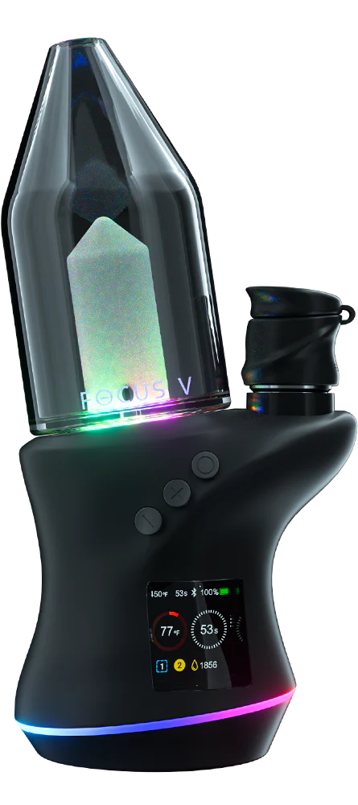
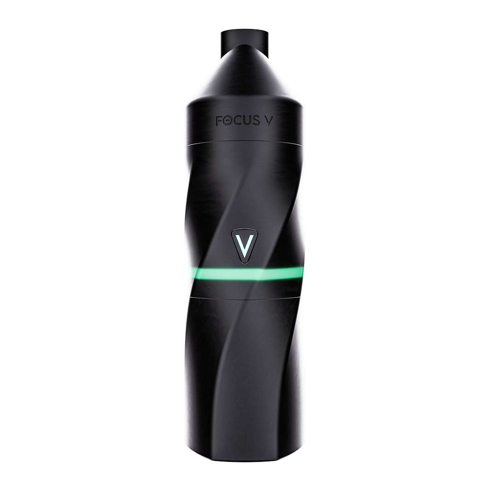

# focusv-ble-research

Independent, hobbyist reverse-engineering of the BLE protocol and firmware used by Focus V's
Carta 2 / Aeris / Carta Sport dab rigs (internally: the "Quantum/Aeris/Sport" device family).
Not affiliated with, endorsed by, or sponsored by Focus V. Done for interoperability, repair,
and personal-device-control purposes — building your own client, understanding what your own
hardware actually does, and diagnosing/recovering a device without depending on the official app.
See [`LEGAL.md`](LEGAL.md) for why this kind of work is on solid legal footing.

<table>
<tr>
<td align="center" width="33%"> <b>Carta 2</b> "Quantum" internally</td>
<td align="center" width="33%"> <b>Aeris</b></td>
<td align="center" width="33%"> <b>Carta Sport</b> "Sport" internally</td>
</tr>
</table>

Product photos © Focus V (Aeris, Carta Sport) and [The Cloud Vortex](https://thecloudvortex.com)
(Carta 2), used here only to identify which hardware this research covers.

## Docs

| | |
|---|---|
| **[BLE Protocol Reference](docs/ble-protocol.md)** | GATT services/characteristics, packet framing, every write/notify opcode found, the real firmware-OTA and screensaver-image wire protocols |
| **[Firmware Architecture Reference](docs/firmware-architecture.md)** | Chip/toolchain, boot chain, the confirmed closed-loop PID temperature controller, thermal safety subsystem, flash layout, firmware self-update mechanism |
| **[Methodology](docs/methodology.md)** | How this was done, plus two non-obvious Ghidra/Telink-TC32 tooling gotchas worth knowing before repeating any of it |
| **[Open Questions](docs/open-questions.md)** | What's still unresolved, as a current punch list |

## Tools

| | |
|---|---|
| **[`tools/focusv-controller.html`](tools/focusv-controller.html)** | A from-scratch Web Bluetooth controller built against the documented protocol |
| **[`tools/ble-tester.html`](tools/ble-tester.html)** | A lower-level BLE opcode tester/logger |
| **[`tools/ghidra-scripts/`](tools/ghidra-scripts/)** | The Ghidra scripts used during firmware analysis (`DumpTC32.java`, `FindXrefs.java`, `dump_tc32.py`) |

No build step for the HTML tools — open directly in a browser that supports Web Bluetooth
(Chrome or Edge; desktop or Android — iOS Safari doesn't implement Web Bluetooth).

## What's deliberately not here

This repo documents findings and cites specific addresses/line numbers rather than redistributing
Focus V's own copyrighted material:

- No firmware binaries. The docs cite specific offsets/addresses; get the actual `.bin` from
  Focus V's own update infrastructure (referenced, not mirrored, in the protocol docs) if you
  need to follow along in Ghidra yourself.
- No copy of the official app's JS bundle.
- No bulk Ghidra disassembly dumps — the architecture doc summarizes what's confirmed; the
  methodology doc explains how to reproduce the analysis from a firmware image you obtain
  yourself.

## Status

This is real, ground-truth-verified reverse-engineering (independently cross-checked between two
separate disassembly toolchains, and cross-referenced against the official app's own source where
possible) — not guesswork dressed up as fact. That said, some things remain genuinely unresolved;
see [`docs/open-questions.md`](docs/open-questions.md) rather than assuming silence means
"solved."

## Roadmap

Everything so far has come from static analysis (Ghidra) and *active* BLE capture (a tool that
is itself the GATT client — `chrome://bluetooth-internals`, `focusv-controller.html`). That has a
real ceiling: these devices only accept one central connection at a time, so an active-client
tool can't watch the real official app talk to a device at the same time it's connected. Hardware
to move past that ceiling is now sourced (see [Methodology § Hardware tooling](docs/methodology.md#hardware-tooling)
for the reasoning and exact parts):

- **A logic analyzer** (8-channel, 24MHz), for passively probing the SPI flash bus and candidate
  GPIO lines directly on the board — targeted at where the heating-element output is actually
  driven, and how the physical button-gesture input is read (no GPIO-*read* primitive was ever
  located in the firmware image itself — see [Open Questions](docs/open-questions.md)).
- **An SWD probe**, for dumping and debugging the Nuvoton M031's own firmware directly — the
  leading candidate for the heating-element driver, previously only theorized about from the
  outside (see [Firmware Architecture § Board hardware](docs/firmware-architecture.md#board-hardware)).
- **SWire tooling for the TLSR8258 itself** — a genuinely separate, non-obvious requirement from
  the SWD probe above; see the Methodology doc for why.

Still planned, not yet sourced:

- **A passive BLE sniffer** (e.g. an nRF52840 dongle running an open-source BLE sniffer
  firmware/Wireshark plugin) — captures the over-the-air link layer directly, without
  establishing its own connection, so it can watch the real app and a real device talk to each
  other simultaneously. Targeted at the OTA-mechanism items in
  [Open Questions](docs/open-questions.md) — the real GATT write-callback, where the erase-trigger
  flag gets set, the finalize/copy step — none of which have been resolvable through active
  capture alone.

This section will move to "Status" once hardware is in hand and produces something concrete to
publish.

## Related

This research feeds into [**Terpline**](https://terpline.hkdev.run) — **a work-in-progress
project, not yet publicly launched.** The link is included for context on where this research is
headed; the linked site should be expected to change, and the Terpline codebase itself isn't
part of this repo.

## Contributing

Corrections, live-capture confirmations, and progress on anything in
[`docs/open-questions.md`](docs/open-questions.md) are all welcome — see
[`CONTRIBUTING.md`](CONTRIBUTING.md) for what makes a finding easy to act on, and the repo's
Issues tab (look for `help wanted`) for what's currently being asked for.

## License

MIT — see [`LICENSE`](LICENSE). See [`LEGAL.md`](LEGAL.md) for the legal reasoning behind doing
this kind of research in the first place.

---

Maintained by **[hashking.dev](https://hashking.dev)**.

 

