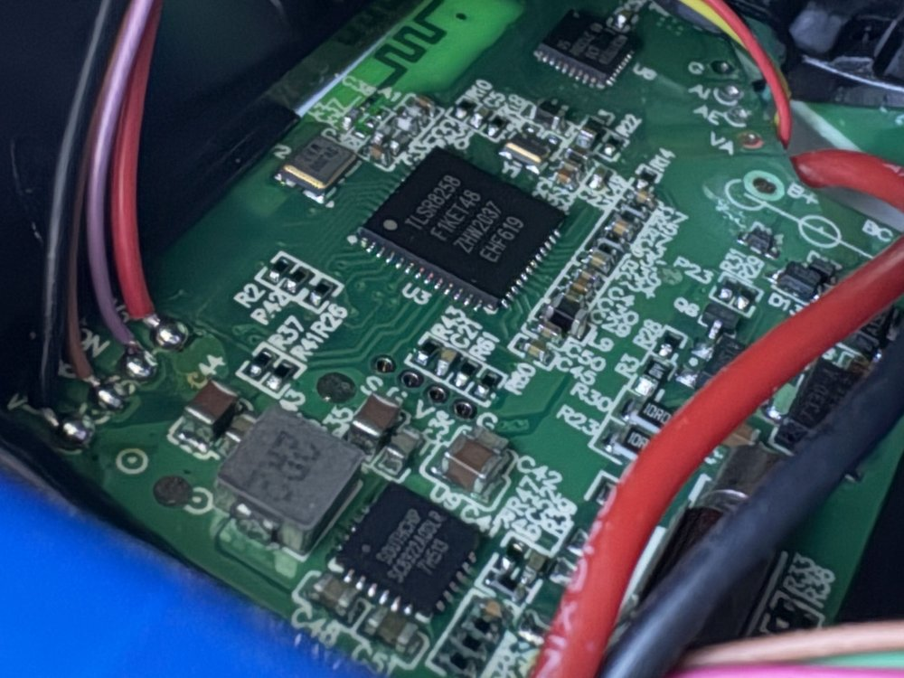
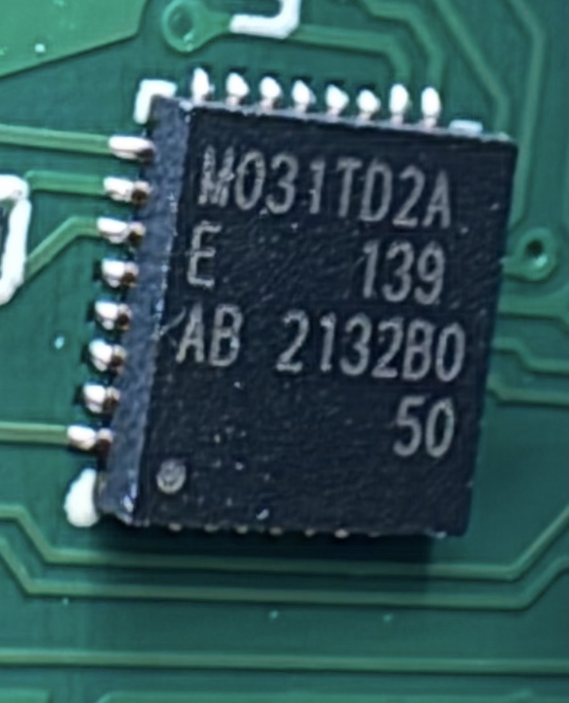
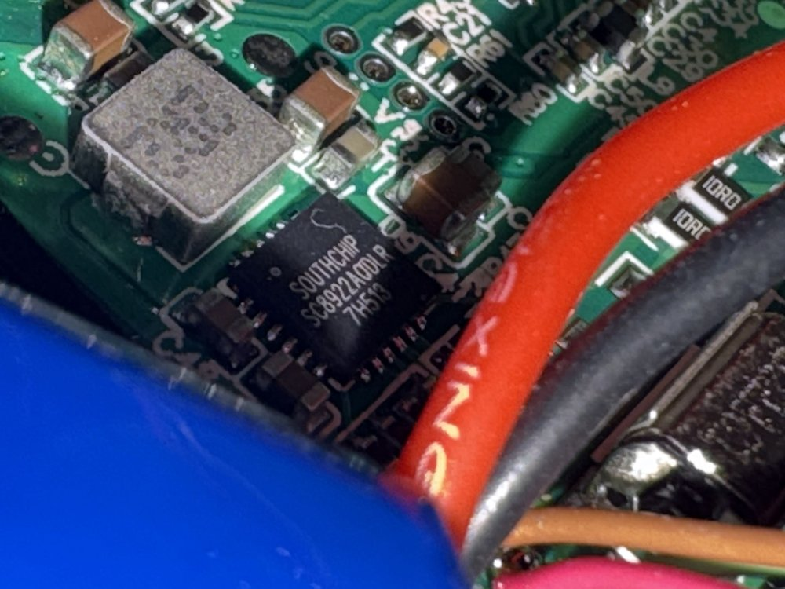
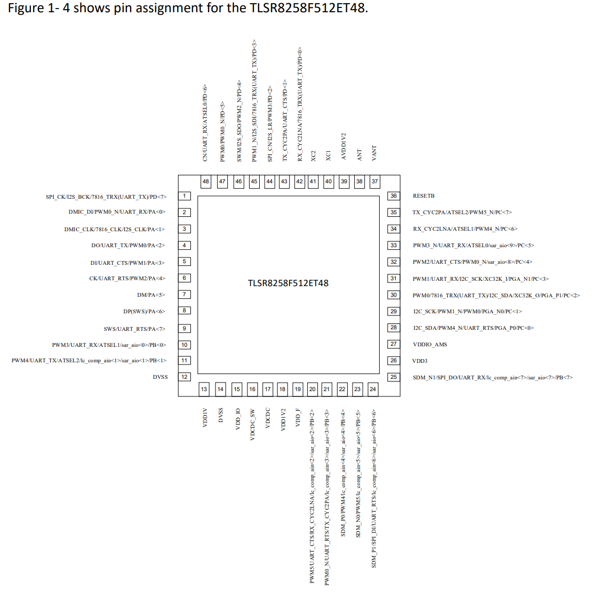

[← README](../README.md) · [BLE Protocol](ble-protocol.md) · **Firmware Architecture** · [Methodology](methodology.md) · [Hardware Setup](hardware-setup.md) · [Open Questions](open-questions.md)

# Firmware Architecture Reference

Reverse-engineered from the OTA firmware image for the Quantum/Aeris/Sport device family (a
Focus V "Carta 2" identifies internally as Quantum — see [BLE Protocol](ble-protocol.md)). This
covers the main SoC's firmware: chip identification, boot chain, the confirmed session/PID
control loop, flash layout, and the real firmware-update mechanism.

**A caveat that applies to this whole document**: the firmware analyzed here is one specific
build. Software updates for these devices have been observed in the wild that are newer than
what any publicly-reachable manifest currently serves (see [Open Questions](open-questions.md)) — general
architecture (boot chain, session/PID loop, flash layout patterns) is unlikely to change much
between point releases, but anything specific to the OTA mechanism itself should be treated as
a working model for *a* build, not necessarily *the current* one, until cross-checked.

## Chip and toolchain

**Telink TLSR8258** — confirmed from the physical part marking on a real board (`TLSR8258
F1KET48`), a 32-bit RISC-like TC32 core (similar to but not identical to ARM Thumb — generic ARM
Thumb disassemblers decode it at best ~56% correctly). Telink publishes a real datasheet and SDK
for this exact part, which turns out to matter a lot in practice — see the callout below.

- **Ghidra 12.1.3** with the community `Telink_TC32` processor module
  ([rgov/Ghidra_TELink_TC32](https://github.com/rgov/Ghidra_TELink_TC32)) — SLEIGH spec compiled
  locally, no prebuilt `.sla` ships with it.
- **Independent validation**: a real `tc32-elf-as`/`objdump`/`ld`/`objcopy` toolchain, built and
  run under Linux (the Windows-hosted community mirror crashes on some systems). A full
  assemble→link→extract→disassemble round-trip confirms the assembler produces correct TC32
  machine code, and `tc32-elf-objdump`'s raw disassembly of the real firmware matches Ghidra's
  byte-for-byte at every point checked — genuine ground truth, not a single-tool guess.
- **[GhidraMCP](https://github.com/LaurieWired/GhidraMCP)** for programmatic access to Ghidra's
  decompiler against a live CodeBrowser session.
- **A real, public SDK for this exact chip** —
  [Telink_825X_SDK](https://github.com/denpaforks/Telink_825X_SDK) (`components/drivers/8258/`)
  — gives ground-truth peripheral register addresses that the Ghidra module's bundled register
  names get wrong (see [Methodology](methodology.md)). Cross-referencing against it directly
  resolved the physical-button-input question below, after several sessions of guessing from
  code shape alone couldn't.

See [Methodology](methodology.md) for tooling gotchas specific to this chip/module combination.

## Board hardware

Everything else in this document is about the TLSR8258's own firmware. Identifying the other
chips on the board (from real part photos) turned out to matter for scoping *what's even in this
firmware image in the first place*:

<table>
<tr>
<td align="center" width="33%"><br><b>Telink TLSR8258</b><br><sub>main BLE SoC</sub></td>
<td align="center" width="33%"><br><b>Nuvoton M031TD2AE</b><br><sub>second MCU, undumped</sub></td>
<td align="center" width="33%"><br><b>SouthChip SC8922A</b><br><sub>battery charger IC</sub></td>
</tr>
</table>

| Chip | Role |
|---|---|
| **Telink TLSR8258** | Main BLE SoC — everything this document otherwise describes: session/BLE handling, the PID control loop, display, flash. |
| **Nuvoton M031TD2AE** (Arm Cortex-M0, 64KB flash, 12× 16-bit PWM channels) | A second, independently-programmable MCU on the same board. Not yet dumped or analyzed — different vendor toolchain entirely (standard Arm, not Telink TC32). **Not the heater driver** — that's now confirmed to run on the TLSR8258 itself (see [Where the heater output is driven](#where-the-heater-output-is-driven) below), which was this chip's leading candidate role. Its actual job is still open. |
| **SouthChip SC8922A** | A 2-3 cell Li-ion boost battery charger IC. Fixed-function analog/mixed-signal silicon — no firmware, not a candidate for anything BLE- or update-related. |

**TLSR8258 pin assignment** — the real part marking (`TLSR8258 F1KET48`) matches Telink's own
`TLSR8258F512ET48` datasheet variant exactly (F512 = 512KB flash, ET48 = QFN48 package), so its
published pin diagram applies directly to this exact board, not just the chip family in general:

<p align="center"></p>

This resolves the SWire pad location flagged as unknown in
[Hardware Setup § Part 3](hardware-setup.md#part-3-tlsr8258-swire-recovery-tooling) — see that
section for the photo-correlated physical pin location and why it still needs a continuity-test
confirmation before being trusted blind.

**Correction (superseded by a newer firmware build's analysis):** this section previously named
the M031 as the leading candidate for driving the heating element, on the reasoning that an
exhaustive search of the TLSR8258 image found no PWM/duty-varying GPIO write, and the M031's 12
PWM channels made it the natural place for that logic to live instead. Disassembling the device's
actual current firmware (`PROD-111224` — the originally-analyzed `PROD-071024` turned out to be a
stale build no longer served to real devices) found the real heater-output routine after all: it
didn't show up in the earlier search because it isn't a PWM peripheral write, it's a plain GPIO
on/off toggle gated by a software tick-window counter (functionally a software-timed slow PWM) —
a different code shape than what that search was looking for. See
[Where the heater output is driven](#where-the-heater-output-is-driven) for the confirmed details.
The M031's real role is therefore open again, not resolved — this document no longer has a leading
theory for it.

**Every standard external communication peripheral on the TLSR8258 has been checked as a possible
transport to the M031**, for whatever its real job turns out to be. A literal-pool scan against the
complete real register map (all 345 entries from the SDK's `register_8258.h` — I2C, SPI, MSPI,
UART, clock/reset, I2S/DMIC) found: SPI traces entirely to the display (confirmed — see
[Display](#display) below); MSPI traces entirely to the on-chip SPI-NOR flash controller; I2C has
zero real hits. The UART is genuinely initialized and enabled at boot, but its data and status
registers — the only two registers any transmit or receive call could possibly use — have **zero
references anywhere in the firmware image**, ruling it out as a data link too. See
[Open Questions](open-questions.md) for what that leaves open.

## File format

The distributed `.bin` has a **40-byte custom header**:

- Bytes 0-7: two 4-byte fields, confirmed **fixed constants** — identical across two real firmware
  files for different device targets with completely different size and content, ruling out a
  content-derived checksum. Not standard CRC32/Adler32 either way; can be copied verbatim into a
  patched image with no computation.
- Bytes 8-11: magic `KNLT` (ASCII) — this is checked both by the app before sending an update,
  and by the firmware itself at boot (see Flash layout below). **Confirmed this is the only header
  content the firmware's own boot-time validity check reads at all** — it reads 9 header bytes and
  checks exactly this one.
- Bytes 12-13: a 2-byte field that does genuinely vary between builds — not a checksum match
  against any standard algorithm/byte-range combination tried (CRC16, CRC32, Adler32). See
  [Open Questions](open-questions.md).
- Byte 24 (4 bytes): self-referencing total file length — confirmed, matches the file's own byte
  length exactly on both real firmware files checked.
- Remaining header bytes: unconfirmed, but also confirmed **not read** by the one boot-time check
  located so far.

All addresses in this document are relative to the file **with that header stripped** (byte 0 of
the stripped image = byte 40 of the original download).

## Boot chain

Confirmed via the actual hardware reset vector — the most reliable ground truth available,
independent of any assumptions about function boundaries.

- **`0x00`-`0x7E`**: interrupt/reset vector table, genuinely all-NOP (64 slots × 2 bytes) —
  verified against raw bytes, not a disassembler artifact. No populated interrupt handlers
  anywhere in this image.
- **`0x80`-`0x112`**: the real reset/startup handler. Checks a boot-reason byte at fixed low
  address `0x4`, sets up the stack(s), zero-fills BSS, copies `.data` from flash to RAM, then
  jumps to `main()`, followed by a jump-to-self trap in case `main()` ever returns.
- **`main()`**: peripheral/clock init, a cold-boot check (with an oscillator-stabilization wait
  on first-ever boot), GPIO pin configuration, then enters the scheduler superloop:

```c
do {
  tick_dispatcher();        // per-tick task dispatcher (BLE queue drain, connection housekeeping)
  *watchdog_feed = 8;
  session_state_machine();  // session/PID/thermal/display tick — see below
} while (true);
```

This is a **single-threaded cooperative scheduler with no preemption anywhere** — the interrupt
vector table is confirmed empty. Any code reasoning about concurrency in this firmware can treat
everything as strictly sequential.

## BLE command handling

Incoming writes on the normal characteristic are queued (a pair of 4-slot ring buffers — one for
fixed 6-byte payloads, one for variable-length ones) and drained by the scheduler's tick
dispatcher, not processed immediately in an interrupt context. The RX opcode dispatcher branches
on the first byte of a write against the documented opcode set (see [BLE Protocol](ble-protocol.md)) and hands
off to per-opcode handlers.

A large portion of this firmware's settings/session/OTA-related logic does **not** decompose into
clean, independently-understandable functions — many different logical entry points (the `0xCC`
handler's marker dispatch, LED-timeout settings, the screensaver transfer state machine) resolve
to the same large, heavily-fallen-through block of code when traced. This is very likely an
artifact of automatic function-boundary detection splitting up what's really a handful of shared
entry points, not five genuinely different copies of similar logic — worth knowing before
assuming a new address is fresh, undiscovered territory.

## Session state machine and PID control loop

The device runs **genuine closed-loop PID temperature control**, not a simple on/off timer as
might be assumed from the marketing material alone.

- **Session-state tick function** — called every scheduler iteration. Operates on a central
  runtime struct holding session state (a byte with observed values `0`, `1`, `3`, `4`, `11`,
  `12`, `13`), a 16-bit countdown decremented once per tick, and drives state transitions
  (playing notification cues at fixed thresholds before a session ends, transitioning through a
  "finishing" state, etc.).
- **PID orchestrator** — pulls the live target temperature from a preset/profile lookup into a
  dedicated struct field, calls the PID math, then periodically logs `(index, temperature,
  power)` triples and transmits them over BLE (the `0xDD` telemetry notify documented in
  [BLE Protocol](ble-protocol.md)).
- **PID math** — textbook: error term (target − measured), an integral term with anti-windup
  clamping, a derivative/rate term, combined into a weighted output, clamped non-negative.
- **Feed-forward overshoot compensation** — bumps the working target temperature up by a tiered
  offset depending on which of three temperature bands the target falls in, to counteract
  thermal/probe lag.
- **Stability detection** — requires the measured temperature to stay within a tolerance window
  for multiple consecutive ticks before declaring "at temperature," guarding against false
  triggers from sensor noise.

**The live target-temperature field is read only once per session/step**, gated behind an
"initialized" flag byte — clearing that flag forces a fresh read from the same struct the `0xCC`
BLE handler writes into. Confirmed (via direct literal-pool byte comparison, not inference) that
the PID orchestrator's struct pointer and the BLE settings-write struct pointer are **the same
runtime struct** — the `0xCC` handler's writes and the PID's setpoint read are already the same
memory, no separate copy step exists.

The **stock re-initialization path has side effects beyond the target temperature** — it also
resets the session-log entry index, an internal power/duty value, and the PID integral
accumulator, among other fields. Anything hooking this re-init path needs to account for that
(e.g. a narrower, purpose-built re-init if only the target temperature should change without
resetting the session log).

### Where the heater output is driven

**Confirmed: all three devices (Carta 2, Aeris, Carta Sport) regulate the heater directly on the
TLSR8258 itself** — there is no second-chip handoff. A dedicated output routine, called every tick
from the main per-tick dispatcher, toggles a single GPIO pin on or off depending on where the
current tick falls within a fixed-length window (500 ticks), comparing against an "on-time" value
the PID step computes and clamps each cycle (roughly 5-449 out of that window) — a software-timed
slow PWM, not a hardware PWM-peripheral write. That's why the original search (looking for a
peripheral duty-register write) came up empty: the real mechanism is an ordinary GPIO toggle,
just one gated by a tick-window comparison instead of a boot-time constant.

| | Carta 2 | Carta Sport | Aeris |
|---|---|---|---|
| Heater GPIO pin | `0x800593` bit 1 | `0x80059b` bit 4 | `0x800583` bit 4 |
| On-time clamp range | 5-449 | 6-449 | 6-449 |
| Window length | 500 ticks | 500 ticks | 500 ticks |

The measured temperature feeding this loop comes from a dedicated platinum RTD (PT1000) on all
three models, not the heater coil's own resistance — converted via the standard
Callendar-Van Dusen equation with the same scaled platinum constants on every device.

This resolves what was previously an open question pointing at the Nuvoton M031 (see
[Board hardware](#board-hardware) above) — that theory is retired.

## Thermal safety / fault chain

A genuine, ground-truth-confirmed safety subsystem, separate from the PID control loop:

- ADC channel configuration and a full sampling routine (7 samples, hardware-timer-paced,
  insertion-sort median filter to reject noise, fixed-point calibrated conversion).
- Called every tick; averages readings and compares against a fixed threshold. **After 3
  consecutive threshold violations**, escalates to a fault handler that sets fault-state flags,
  logs an error code, and fires a distinct error notification (LED + buzzer pattern) — one branch
  appears to abort an in-progress session.

This subsystem only *reads and checks* — it does not appear to drive the heater output itself.
Any firmware modification should leave this path untouched.

## AES-128 telemetry encryption

The `0xDD` telemetry notify (measured temperature, power output, controller-state byte, and the
three PID terms — the data behind the official app's hidden "Real-Time Results" dialog) **is
AES-128-encrypted before transmission, on all three devices**. Confirmed via a clean decompile of
each device's engine-invoke function, which resolves the hardware AES block's three arguments
unambiguously: a key (copied into a fixed MMIO key-load window), the plaintext telemetry struct,
and a ciphertext-out buffer read back once a done bit is set — not a software cipher, a real
on-chip AES-128 peripheral (MMIO control register, 16-byte key-load window, data port).

**The key material is not a secret in any meaningful sense.** For both Carta 2 and Carta Sport, the
16 "key" bytes were confirmed to sit in the middle of an ordinary ascending calibration-curve
lookup table already resident in flash for an unrelated purpose — the firmware reuses
already-present calibration data as a de-facto key rather than allocating a dedicated random
secret. Reads as obscuring the raw telemetry from casual BLE sniffing (hence "hidden" in the
official app), not a real security boundary — consistent with there being no authentication,
rotation, or per-session key derivation anywhere in this path. Carta 2's and Sport's extracted keys
are confirmed different from each other.

The Aeris key could **not** be extracted the same way, and the reason is itself a confirmed,
interesting finding rather than a gap: the boot-time flash→RAM `.data` copy loop's declared range,
taken literally, overruns the end of the downloadable OTA image by exactly 24 bytes on both Carta 2
and Aeris (Sport's copy loop doesn't overrun at all, which is why its key extracted cleanly). The
consistent 24-byte shortfall across two structurally different builds reads as **factory-provisioned,
per-unit calibration data deliberately excluded from the OTA-downloadable image** — so a firmware
update can't clobber per-device calibration during the copy. Carta 2's key read sits comfortably
clear of this excluded tail; Aeris's key read falls entirely inside it. The only way to recover the
real Aeris key is a live RAM or flash read from real hardware, not more static analysis of the
downloadable image.

## Physical button input

The GPIO register map (see [Chip and toolchain](#chip-and-toolchain)) is a per-port-group block,
8 bytes apart, with the *input data* register as the first byte of each group and *output data*
as the fourth:

```
Port bases: A=0x800580, B=0x800588, C=0x800590, D=0x800598, E=0x8005a0
  +0: in (read)   +1: ie   +2: oen   +3: out (write)   +4: pol   +5: ds   +6: func   +7: irq_en
```
Ports B and C are configured indirectly through the analog-register bus (see below); A, D, and E
are direct memory-mapped reads/writes.

**Confirmed: the physical button input is read every single scheduler tick**, polling
`reg_gpio_pd_in` (`0x800598`) bits 1 and 5 — two distinct physical inputs — through a textbook
software debounce: 6 consecutive same-state ticks confirms a press, 5 confirms a release, and a
separate 14-tick counter on the second bit distinguishes a short press from a hold. Confirmed
events are written into a small record (tag + tick-count-derived code) that appears to feed the
same style of tag/param dispatch used for BLE commands elsewhere in this firmware, though its
consumer hasn't been traced yet.

A second function, also called every tick, gates on **both** `reg_gpio_pc_in` (`0x800590`) bit 0
and the same `reg_gpio_pd_in` bits — when satisfied, it reconfigures several GPIO *output*
registers at once and calls a helper with char-valued parameters (matching this firmware's
general pattern of using ASCII-char op-codes, e.g. `'t'`/`'v'` for OTA). Plausibly a
button-combo-gated mode/output change; not fully traced.

**Per-device click/gesture tables, fully decoded** (device state numbering and event numbers
confirmed by decompile, not inferred from behavior alone):

Aeris and Sport share the same single-button state machine and the same event numbering almost
exactly (device states: 0=off, 1=on/idle, 7=quick-heat-from-off, 8=asleep):

| Clicks/gesture | Sport/Aeris event | Action |
|---|---|---|
| 1 | 7 | idle: cycle preset slot. Session: n/a |
| 2 | 8 | — |
| 3 | 9 | cycle LED preset rank |
| 4 | 10 | show battery bars (LED effect 6) |
| 4 + hold | 12 | toggle low-power mode |
| 5+ / BLE off | 11 | power off |
| 2 + hold 2-2.5s | 13 | quick-heat from off → state 7 |
| hold ~2s | 15 (Sport) / 0xf (Aeris) | stop (session must be active) |
| any BLE write | 17 | wakes device from sleep — how the app's "keep awake" works |
| charger plug/unplug | 21 / 22 | LED effect + buzz |

Carta 2 has a genuinely different, 3-input scheme (main button plus two secondary inputs, decoded
from a packed 3-bit state through a dedicated jump table) — the only one of the three with
dedicated **up/down controls with hardware auto-repeat** (secondary inputs held down repeat every
~80ms after an initial ~0.5s delay), used to adjust custom temperature/duration values directly
from the device without a connected app.

## Display

A standard ST7789-family TFT LCD driver (240×240 active window on a 240×320 physical GRAM,
matching the screensaver image resolution documented in [BLE Protocol](ble-protocol.md)) — all commands match
the published ST7789 command set exactly, no proprietary quirks.

Confirmed drawing primitives, usable directly from firmware with no BLE transfer involved:
- Set drawing window (CASET/RASET).
- Solid-fill rectangle.
- 1-bit-per-pixel glyph/bitmap draw with independent foreground/background color — the same
  primitive used throughout the stock settings/session UI for on-screen text and numbers.

A local firmware draw call using these primitives is effectively instant compared to a full
BLE-uploaded screensaver image (which takes thousands of individual 16-byte writes).

**The live-heating screen, fully decoded.** One routine (`FUN_0000fa1c`) assembles the entire
live-heating screen every tick, calling five drawing functions in a fixed sequence — this is the
routine the custom ramp patch's display changes hook into (see
[Custom firmware](#custom-firmware-device-native-hardware-ramp) below), and decoding it fully is
what caught a real gap in that patch (two of these five calls weren't being suppressed, see
below). Left to right on screen: a dual-unit target-temperature header (showing the target in
whichever unit the device is currently set to), the large primary measured-temperature number with
its progress gauge and a charging-aware icon, and a battery-percentage readout (3 digits plus a
5-step battery-bar icon, or a distinct charging-animation primitive while plugged in) at the far
right. A separate branch, taken only around session start/end, swaps in a transition sequence
instead of this normal five-call path.

Screen/menu navigation (Carta 2 only) is a confirmed state machine: a current-screen field (0-16)
dispatched through a jump table, with real resolved meanings for every number — heating,
splash/transition screens, home/idle, two "edit custom value" screens wired directly to the preset
struct fields the up/down buttons adjust, and several scrollable menu-list screens. A shared
"cancel/back out" sequence is reachable identically from four different idle screens on a
long-hold gesture.

## Battery and charging

Genuinely different mechanisms per device, confirmed rather than assumed identical:

- **Carta Sport**: a real fuel-gauge IC (bit-banged I²C, register map consistent with the
  CW2217 family — not confirmed from a board photo). A dedicated battery-gauge routine averages
  three ADC channels every tick, integrates a charge counter, and writes both a 0-100% value and a
  bar count (thresholds roughly 74/49/24%) into the shared runtime struct.
- **Aeris**: **no fuel-gauge chip found** — estimates charge from voltage alone, averaging a small
  raw-ADC sample block on a slower cadence. Confirmed bar thresholds (<25%/25-49%/50-74%/≥75% →
  1-4 bars) match the documented LED error-colour table exactly (the same color codes used for
  low-battery/empty-battery alerts double as the battery-bar display color).
- **Carta 2**: less thoroughly traced than the other two; no dedicated battery-percentage routine
  was separately pinned down for this device specifically, though the stock live-heating screen
  does display one (see [Display](#display) above, `FUN_0000db40`).
- **Charger detection** (Sport, and presumably similar on Aeris): a dedicated GPIO pin, debounced
  over several consecutive ticks in each direction, flips a "charging" flag used both for the BLE
  status byte and a plug/unplug LED+buzz cue.
- **Shared charging hardware**: a fixed-function Li-ion boost charger IC on the board (no
  firmware of its own) — this rules it out as any kind of programmable "battery MCU," relevant to
  why the app's `*BatteryUpdateServer` manifest config fields (present but always 302-redirecting,
  never actually published on any device family) are presumed vestigial rather than pointing at a
  real updatable component.

## Flash layout

Standard SPI NOR flash, textbook opcodes (Read Data `0x03`, Write Enable + Sector Erase `0x06`+
`0x20`, Write Enable + Page Program `0x06`+`0x02`, Read Status Register `0x05` for busy-poll,
JEDEC ID `0x9F`). **Sector erase is required before any write** — writes cannot happen in place
without first erasing the containing 4KB sector.

### Settings sectors

A dozen-plus flash regions, each exactly 4KB (`0x1000`) apart, one setting category per sector,
each with its own sentinel/magic byte (falls back to hardcoded defaults if the sentinel doesn't
match — the standard "never written yet" pattern, since erased NOR flash reads as `0xFF`):

```
0x80000-0x8c000 (several sectors)   general settings
0x8e000                             settings
0xca000                             separate settings category
0xcb000+                            session-log storage (16-byte entries)
```

### Screensaver image storage — corrected

**`0xAC000` and `0x8F000` are the two screensaver image save slots, not firmware A/B banks** (an
earlier working theory in this research, now retracted after directly decompiling the function
that uses them — it renders a saved image from flash onto the LCD; it never writes flash at all).
The address spacing (`0x1D000` = 118,784 bytes) exactly matches one 240×240 RGB565 image
(115,200 bytes) rounded up to a whole number of 4KB sectors — consistent with the two save slots
documented in [BLE Protocol](ble-protocol.md)'s screensaver section.

### Real firmware OTA mechanism — corrected

**The "two-phase staging" model this section used to describe was wrong — there is no staging
buffer and no separate finalize/copy step, on any of the three devices.** That model was a
reasonable reading of Carta 2's boot-time validity check alone (below), but tracing the actual
live OTA write path on all three devices independently found the identical single-phase
mechanism instead: blocks are written directly to their final address as they arrive, at
`block_index*16 + base`. On every device, `base` resolves to `0`:

- **Aeris** (callback at disassembly `0x116ec`): `base` is a struct field that nothing in the
  binary ever sets — Telink's standard BSS zero-init leaves it at `0`, confirmed by finding every
  one-line setter touching this struct and none of them touching that field.
- **Carta 2** (callback at `0x189ec`): same struct shape, same elimination proof, same result.
- **Carta Sport** (callback at `0xe2cc`): a different code-generation choice — `base` lives in a
  standalone global rather than a packed struct — but the same conclusion: that variable has
  exactly one reference in the entire firmware image (the read used by the gap-recovery erase
  loop), so it's never written either, and stays at its BSS-zero default of `0`.

There's no finalize step on any of them because there's nothing to finalize: the bytes land in
their real, final location the moment each block is written. Full trace (exact addresses, the
setter enumeration, and the gap-recovery erase loop each was found through) is in
[Open Questions](open-questions.md).

**This means Carta 2's boot-time validity check erasing at `0x40000` (below) is not the live OTA
staging area it looked like** — the live write path there uses base `0`, same as the other two.
What that `0x40000` erase is actually for is now open again, not resolved by this (see Open
Questions) — most plausibly an unrelated recovery/fallback path that happens to erase a large
region without it being where OTA writes land.

The boot-time check itself, independent of the above:

- A validity check reads the 40-byte header at the very start of the flash chip (real address
  `0x0`) and checks for the `KNLT` magic at byte offset 8.
- If valid, a large region (61 sectors, ≈244KB — comfortably more than the actual firmware image
  size) is erased starting at real flash address `0x40000` on Carta 2.
- If the header at address `0` is *not* valid, the same erase targets address `0` directly
  instead — most plausibly a recovery/first-flash fallback path, not the normal update route.
- On Aeris and Carta Sport, the equivalent pre-erase (same shape: a fixed-size sweep, skipping
  sectors already blank) runs once at boot from the main init function, over a region sized by
  hardcoded immediates set at a single, very early call site on each device — not derived from any
  live OTA command. This is exactly why an ordinary in-order OTA transfer never needs its own
  erase call on any of the three: by the time any transfer can start, the target region was
  already erased at the last boot. (A separate, second erase path exists inside each device's live
  write callback, but only triggers on a sequence gap — a defensive re-erase for a
  resumed/interrupted transfer.)

**No evidence of a hardware bank-remap register was found** on any of the three devices — the
confirmed boot chain is a single, fixed execution location per device. See
[Open Questions](open-questions.md) for what remains genuinely open (what the Carta 2 `0x40000`
erase is actually for, and the mask-ROM bootloader question).

## Custom firmware: device-native hardware ramp

Stock firmware has no native "ramp" concept — the only way to sweep temperature over time is for
a client to send a series of timed `0xCC` writes (see [`tools/focusv-controller.html`](../tools/focusv-controller.html)'s
Ramp tab). A patch adds a genuine device-native ramp instead: waypoints saved once to flash, then
run autonomously by the firmware's own tick loop with no client connected. **The patch exists
for all three devices (Carta 2, Aeris, Carta Sport), built and verified in software (address
traces, host tests, a Carta 2 screen test) but not yet run on hardware** -- the source, patch
bytes, per-device build fingerprints, the protocol ([`PROTOCOL.md`](https://github.com/hashking710/focusv-ramp-firmware/blob/main/PROTOCOL.md))
and the verification ledger ([`VERIFICATION.md`](https://github.com/hashking710/focusv-ramp-firmware/blob/main/VERIFICATION.md))
live in the companion [focusv-ramp-firmware](https://github.com/hashking710/focusv-ramp-firmware)
repo. What follows is the architecture in brief; that repo is the reference (see its `LEGAL.md`
for why the split exists).

**Mechanism, same shape across all three devices:**

- **Commands ride on the stock `0xCC` packet**, which stock parses before the patch sees it (the
  patch hooks the marker-byte load, byte 13): `0xB1`-`0xBA` save flower / concentrate stages 1-5
  from the packet's custom values, `0xBB` sets the setup offset, `0xBD` switches stock / ramp mode,
  `0xBE` chooses the built-in preset, and the stock start `0xA5` with `0x52` in byte 14 asks for that
  session to run as a ramp. Stock reads bytes 2-13 only (checked by resolving every register-indexed
  load in each handler), so byte 14 is free.
- **A ramp runs inside a stock session.** Each stage writes the active preset slot (both units) and
  clears "reached", the way stock changes temperature mid-session; the stock heat-up, PID and
  safety limits stay in charge. The session countdown is the ramp's clock, and every hold is time
  at temperature (all three stock clocks wait for "reached"). The slot is put back at the end.
- **Starting.** From an app: the `0xA5` request above, on whatever preset is active. From the
  device: a session on a preset slot holding the trigger (150 °F, or 65 / 66 °C).
- **The store** lives outside both OTA banks (stock wipes the bank it isn't running from at every
  boot), as two copies with a commit byte written last, so a power cut never loses it.
- **Detection.** The patch wraps the stock send of the `0xAA` dab-counter reply (Carta 2 `0x11562`,
  Aeris `0xb066`, Sport `0xa9ea`) and queues an `0xBC` announcement (protocol, device, flags --
  ramps enabled, stock mode, a ramp running -- preset, offset), also sent on every change and when a
  ramp starts or ends. The notify routines (`0x15a34` / `0xe734` / `0xec3c`) are the SDK's
  `bls_att_pushNotifyData` (handle 27).

**Stock mode and the device gestures.** Stock mode (`0xBD`) turns every hook into a pass-through.
It's also switched on the devices themselves: on the Carta 2 at power-on (hold − while pressing the
power button five times for ramp mode, + for stock mode -- stock ignores the main button while
another is down, so the patch counts those presses from the pins), on the Aeris and Sport with five
presses and the fifth held (a hold with the press count at 5, unused in stock).

**Built-in presets and the picker.** Concentrate mode ships six built-in ramps (`common/ramp_presets.c`),
shifted by the setup offset and clamped to 440-520 °F; uploaded stages take precedence. On the Aeris
and Sport a hold from idle (a single press, LEDs on) opens a picker: clicks step through four
presets on the LEDs and the button light, a triple click switches the ramp system on or off, a hold
leaves. The Carta 2 has no picker -- every idle gesture already has a stock meaning -- and its
preset is chosen from an app (`0xBE`).

**What a patch command does on stock firmware.** Aeris and Sport: it resets the keep-awake counter
(`0xFA` into `+0x40`) and exits. Carta 2, on the live screen: any marker other than `0x66` runs the
same post-command housekeeping a start or stop does (`0x11dc2`: `0x10c98` clamps the preset tables to
the device limits and re-syncs them, `0x10b38` re-applies settings, view 15 is drawn). A stage save
also writes the custom preset, as any `0xCC` packet does.

**Screen and LEDs.** The Carta 2 draws a ramp screen (chart, meter, dab count, the Terpline logo
streamed through the stock LCD driver) from hooks on its view functions, only while a ramp runs,
and repaints the full stock view when it ends. The Aeris and Sport show progress and temperature on
their LEDs and the control button's light (Aeris: an RGB LED on PB5-PB7, software PWM `0x49c`, duty
`0x845602` / `0x8455fc` / `0x8455fe`; Sport: one more addressable LED sent by `0x8efc`), from a wrap
of the single call to each LED effect dispatcher (Aeris `0x920c` at `0x61ae`, Sport `0x8ff8` at
`0x57ee`).

**A real mistake, caught before it shipped, worth recording precisely rather than smoothing over**:
an earlier pass through this same work identified the Carta 2 orchestrator as `FUN_0000ad4c`,
reached from a call site at `0x6e2e`. Re-deriving this fresh against the current firmware build
found `0xad4c` is **not a function at all** in that build — it was carried over from an older,
different firmware build without being re-checked. The real orchestrator is `FUN_0000af2c`,
confirmed by direct decompile (it operates on the session-active flag exactly as expected, and
calls the already-confirmed RTD-conversion and tolerance-check routines). The call site, however,
genuinely is `0x6e2e` — Ghidra's auto-analysis simply never wraps the surrounding code in a named
function for this build (a known gap with this chip's Ghidra module, see [Methodology](methodology.md)),
so there was no cross-reference to follow. It was confirmed instead by generating the exact
correct `tjl 0xaf2c` instruction encoding, with the real assembler, at *every possible position* in
the entire firmware image, and byte-comparing against the real file — exactly one match, at
`0x6e2e`. The same address as the stale notes claimed; only the function being called from it was
wrong. This exhaustive-scan technique is now the standard fallback whenever a confirmed function
has no discoverable caller via normal cross-reference tooling — it was used again for both Aeris
and Carta Sport below.

A second mistake of the same shape was caught in the marker-dispatch design itself: the original
plan patched a single leaf of the `0xA5`/`0xAF`/`0x66` compare-and-branch chain (the `0x66` case
specifically). That works for replicating `0x66`, but the five new waypoint markers never match
any of the three existing comparisons, so patching one leaf means they're never seen at all — the
packet just falls through the whole chain untouched. The fix is architectural, not just a
corrected address: the patch intercepts the marker *byte load* that runs unconditionally before
any of the three comparisons, not any individual leaf of the chain.

**Not yet tested on real hardware**, for any of the three devices — gated on recovery/flashing
tooling (see [Hardware setup](hardware-setup.md)). The exact real-time meaning of one "tick" in
each firmware's own scheduler (assumed ≈1 second, never independently clocked against a wall
clock) and whether a long ramp can outlast the device's own built-in session-duration ceiling are
both open until then, for all three devices.

### Carta 2 ("Quantum") — confirmed addresses

- Central runtime struct: `0x843028`. Session-active `+0x1`, mode flag `+0x7` (0=flower,
  1=concentrate), live PID target `+0x20`/`+0x22`, measured temperature `+0x1c` (confirmed via
  the RTD/Callendar-Van Dusen conversion routine, `FUN_00008b08`, writing directly into this
  field), custom-value temperature `+0x36`/`+0x4e` (Celsius).
- Per-tick orchestrator: `FUN_0000af2c`, called from `0x6e2e` (see above).
- `0xCC` handler real marker-dispatch call site: `0x11d96`, inside a function Ghidra's current
  auto-analysis calls `FUN_00011d82` (part of a larger merged-function cluster — see
  [Methodology](methodology.md)). The real handler chain is `FUN_000115f2` (top-level dispatcher)
  → `FUN_00011cc4` (temp/duration field parsing, confirmed via decompile) → tail-jumps through two
  small intermediate functions → the marker-load-and-compare block at `0x11d96`-`0x11db1`.
- Has a screen — the patch replaces the live-heating display with a graph; see
  [Display](#display) above for the confirmed drawing primitives this uses
  (`FUN_000074d0` solid-fill, `FUN_00007e2c` glyph blit, digit table at `0x1e6cc`).
- **A third mistake, caught in a later audit of this patch after it had already shipped** (briefly —
  never flashed by anyone): the live-heating screen refresh routine (`FUN_0000fa1c`) calls five
  screen elements unconditionally every tick, not three. The original patch suppressed the main
  gauge (`FUN_0000d3c0`), the countdown timer (`FUN_0000d048`), and the preset badge
  (`FUN_0000e42c`) — but missed `FUN_0000dcac` (a second, structurally parallel gauge/digit
  display, confirmed by decompile to draw directly over part of the graph's own screen area) and
  `FUN_0000e300` (a small status icon in the same row as the already-suppressed countdown/badge).
  Both were still running unconditionally, every tick, regardless of ramp state. Found by reading
  `FUN_0000fa1c`'s real call sequence directly rather than trusting the original three-site design,
  and fixed the same way as the other two suppressed elements. Freeing `dcac`'s screen region also
  let the graph grow from 150×140 to 220×164 pixels, using real confirmed free space instead of an
  earlier conservative guess. One related branch (`FUN_0000e2b4`, an alternate full-width banner
  gated on two struct flags) was deliberately left unpatched and documented rather than guessed at —
  see the patch repo's Carta 2 README for the full reasoning.

### Aeris — confirmed addresses

Same overall shape as Carta 2, different binary, different addresses — none reused without
independent re-confirmation. Aeris has no screen; ramp progress shows as a cool-blue-to-hot-amber
color gradient across its 4 individually-addressable RGB LEDs instead.

- Central runtime struct: `0x8430e4` (distinct from the device/session-state struct at `0x84308c`
  used by the button/event dispatcher and the LED-push gate — two separate confirmed structs, not
  one).
- Mode flag `+0x6`: **1=flower, 2=concentrate** — a different convention from Carta 2's 0/1,
  confirmed by direct observation rather than assumed to match.
- Measured temperature `+0x2a`, custom-value temperature `+0x30`/`+0x48` (confirmed real
  Fahrenheit when the incoming packet is Fahrenheit-scale — the `0xCC` handler has a scale-byte
  branch to a Fahrenheit-specific code path that writes this field unconverted, then tail-jumps
  back into the shared body; both branches were traced to confirm they reconverge on the same
  marker-dispatch chain regardless of which was taken).
- Live PID target `+0x2c`/`+0x2e` — this one is **reasoned from converging facts, not one traced
  instruction**: confirmed as what the stock "temperature reached" detector compares against the
  measured field, and confirmed to be populated for preset-selected sessions via a direct,
  unconverted copy from the preset table (whose own factory-default values — 300, 350, 370, 390,
  410 — are unmistakably real °F). The exact stock code path that populates it for a *custom-value*
  session specifically was traced extensively (an atomizer-calibration routine, a glide/smoothing
  function, several rank-dispatch jump table entries) without finding one clean "convert and
  write" function — recorded as a real, specific gap rather than papered over, even though the
  two converging facts above are enough to be confident in the field's identity and unit.
- Per-tick orchestrator: body starting `0x8154`, called from `0x6464` inside the main scheduler
  loop (confirmed via the same exhaustive-scan technique described above — one match in the
  entire 80,684-byte firmware).
- Marker-dispatch load: `0xb490`.
- LED buffer `0x8431dc` (4×RGB), brightness byte `0x84562c+1`, push routine body starting `0x90bc`.
  Its push-gate flag (`0x84308c+0xe`) genuinely does control whether anything gets pushed to
  hardware at all here (unlike Sport, below) — the patch deliberately forces it open before every
  push during a ramp.
- Flash primitives, independently confirmed (Carta 2's addresses for these do not exist as
  functions in this binary): read `0xab8`, erase `0xa1c`, write `0xa5c`.
- ROM divide helper: `0x1ac` — same address as Carta 2, confirmed still valid here.

### Carta Sport — confirmed addresses

Same overall shape again, with two real divergences from Aeris caught by re-checking rather than
assuming the pattern holds:

- Central runtime struct: `0x8426ec`, shared by both the `0xCC` handler and the tick function
  (confirmed by resolving both functions' literal-pool pointers independently and finding they
  match). Device/session-state struct: `0x842694`.
- Mode flag `+0x6`: 1=flower, 2=concentrate — same convention as Aeris.
- Measured temperature `+0x2a`, custom-value temperature `+0x30`/`+0x48` (confirmed real
  Fahrenheit the same way as Aeris — the Fahrenheit-scale branch's field writes were read end to
  end, not inferred by analogy to Aeris). Live PID target `+0x14`/`+0x16` — same "reasoned from
  converging facts" status as Aeris's analogous fields.
- Per-tick orchestrator: body starting `0x7c00`, called from `0x58b0` (exhaustive-scan confirmed,
  90,860-byte firmware, one match).
- Marker-dispatch load: `0xb002`.
- LED buffer `0x8427f8` (**5**×RGB — confirmed hardware difference from Aeris's 4, via the push
  routine's own loop-count), brightness byte `0x844b3c+1`, push routine body starting `0x8cf8`.
  **Its gate architecture is genuinely different from Aeris's**, confirmed by reading both rather
  than assumed identical: Sport's gate flag only controls an optional "reset buffer to black"
  pre-step, and the actual hardware push loop runs unconditionally every call regardless of that
  gate. The patch does not force anything open here, unlike Aeris.
- Flash primitives, independently confirmed (neither other device's addresses apply): write body
  starting `0xc0e8` (signature `addr, len, buf`), erase `FUN_0000c178(addr)` (issues SPI opcode
  `0x20`, Sector Erase). No dedicated read primitive — flash is memory-mapped for reads here too.
- **ROM divide helper: `0x1529c` — confirmed to be a completely different address from both
  Carta 2 and Aeris's `0x1ac`**, which is confirmed absent as a function in this binary. The
  single most consequential catch in this device's whole build process: reusing `0x1ac` unchecked
  (easy to do, since it worked for two other devices already) would have meant every division the
  patch performs jumped into unrelated code on a real device. Checked and confirmed absent before
  writing any code that might have assumed otherwise.

### Arming from the device's own physical button

Carta 2 specifically: the sentinel-based trigger is source-agnostic — `ramp_tick()` only ever
inspects the shared runtime struct's live target field each tick, and doesn't know or care how a
150°F-equivalent value got there. Writing the sentinel into any one of a mode's 5 real
session-preset slots (via the normal preset-table-write opcode) turns that slot into a physical
trigger: selecting it on the device and starting a session with it — the same physical gesture
used to start any other saved preset, no BLE involved — arms the ramp exactly as if the
sentinel-carrying start command had been sent over Bluetooth. This permanently repurposes that
slot until a real value is written back to it. Physical stop needs no special handling either —
whatever clears the session-active flag already forces `ramp_tick()`'s own reset path, the same
as a BLE-driven stop. The same mechanism applies unchanged to Aeris and Sport, since both share
the identical wire packet format and the identical sentinel-field architecture.

## Open questions

See [Open Questions](open-questions.md) for the full, current list of unresolved items, including
the real OTA-receive code path, boot-time behavior not covered by this image, and the
firmware-version caveat mentioned at the top of this document.
